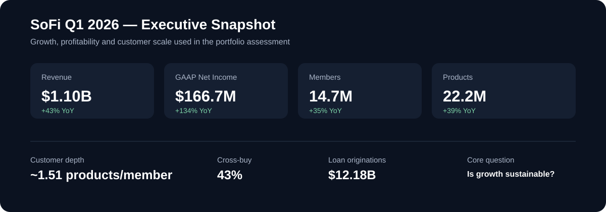
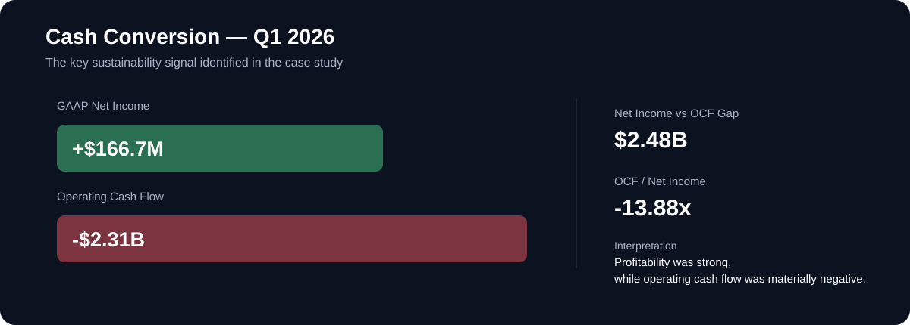
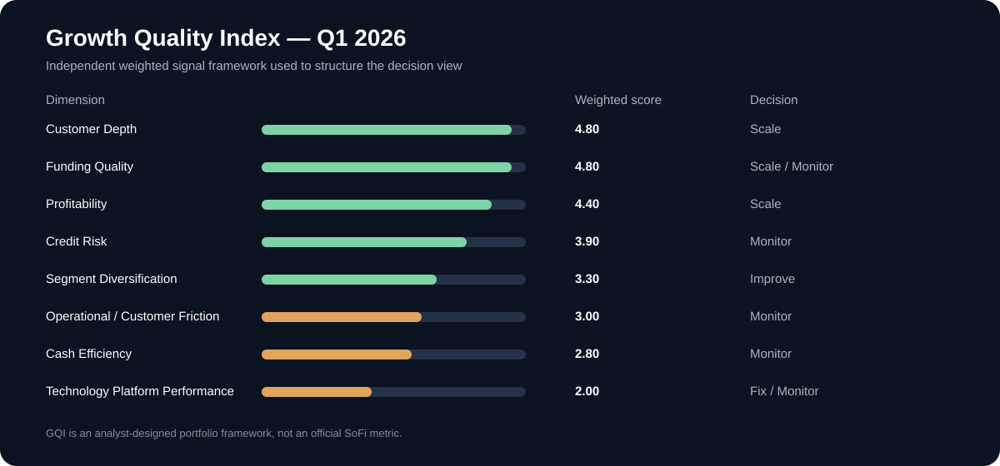

# SoFi Q1 2026 Growth Quality Assessment

**Business Analysis Portfolio Case Study | FinTech / Financial Services**

## Business Question

**Is SoFi's rapid Q1 2026 growth also high-quality and sustainable?**

I built this independent case study to look beyond headline growth and examine how **customer depth, profitability, lending, funding, credit risk, cash conversion, diversification, and customer friction** interact.

The project demonstrates an end-to-end BA workflow:

**Business Question → Requirements → KPI Framework → Data → SQL → Excel → Power BI → Decision Signals → Recommendations**

<p align="center">
  
</p>

## What I Did

- Framed the business problem and defined the key analytical questions.
- Converted those questions into **business and analytical requirements**.
- Defined KPIs, calculation logic, source traceability, and derived metrics.
- Prepared and validated public-source data using **SQL and Excel**.
- Built Power BI/DAX analysis and an executive dashboard.
- Designed an independent **Growth Quality Index (GQI)** to structure the evidence into decision signals.
- Translated the analysis into executive findings and recommendations.

## Key Findings

### Growth & Customer Depth

- **Revenue:** $1.10B | **+43% YoY**
- **GAAP Net Income:** $166.7M | **+134% YoY**
- **Members:** 14.7M | **+35% YoY**
- **Products:** 22.2M | **+39% YoY**
- **Loan Originations:** $12.18B
- **Products per Member:** ~1.51
- **Cross-Buy:** 43%

Products grew faster than members, providing a **directional proxy for improving customer depth**. Products per member is a project-derived measure, not an official SoFi KPI.

### Cash Efficiency

- **GAAP Net Income:** +$166.7M
- **Operating Cash Flow:** -$2.31B
- **Net Income vs OCF Gap:** $2.48B
- **OCF / Net Income:** -13.88x

The analysis does not treat negative operating cash flow as automatically negative business quality. Instead, it raises the more useful BA question:

> **What is happening to cash conversion as the business scales?**

<p align="center">
  
</p>

### Segment Diversification

Project-derived shares of reported Q1 2026 segment net revenue:

- **Lending:** 56.1%
- **Financial Services:** 37.4%
- **Technology Platform:** 6.6%

Financial Services strengthens the diversification case, while Technology Platform weakness limits how far that conclusion can be taken.

### Customer Friction

CFPB complaints are used only as an **external public proxy for customer friction**, not as internal SoFi support data.

- **Q1 2026 complaints:** 940
- **Complaints per million members:** 63.92
- **Selected CFPB analysis window:** January 1, 2025 – July 10, 2026
- **Records in selected extract:** 4,724

The CFPB dataset is not treated as representative of all customers or all customer-service interactions.

## Growth Quality Index

| Dimension | Weighted Score | Decision |
|---|---:|---|
| Customer Depth | 4.80 | Scale |
| Funding Quality | 4.80 | Scale / Monitor |
| Profitability | 4.40 | Scale |
| Credit Risk | 3.90 | Monitor |
| Segment Diversification | 3.30 | Improve |
| Operational / Customer Friction | 3.00 | Monitor |
| Cash Efficiency | 2.80 | Monitor |
| Technology Platform Performance | 2.00 | Fix / Monitor |

<p align="center">
  
</p>

**GQI is an independently designed analytical framework, not an official SoFi metric or management scorecard.**

## Repository Architecture

```text
SoFi Q1 2026 Growth Quality Assessment
│
├── README.md
├── assets/                 # Recruiter-facing visual previews
├── sql/                    # SQL schema, preparation & analytical queries
├── analysis/               # Excel analytical bridge
├── dashboard/              # Power BI model & dashboard PDF
├── documents/              # Requirements, KPI dictionary & source mapping
├── methodology/            # GQI methodology
└── presentation/           # Executive presentation
```

### How to Read This Repository

**30-second path:** Start with the README visuals and **Executive Presentation**.

**Evidence path:** Requirements → KPI Dictionary → Data Source Mapping → SQL → Excel Bridge → Power BI → GQI Methodology.

The repository is structured so the reasoning can be traced from **business question to executive recommendation**, rather than presenting a dashboard as a standalone artifact.

## Project Artifacts

### Executive / Decision Support

- **[Executive Presentation](presentation/SoFi-Q1-2026-Growth-Quality-Assessment_.pdf)**
- **[Power BI Dashboard](dashboard/SoFi_Q1_2026_Growth_Quality_Analysis_Dashboard.pdf)**

### Business Analysis Documentation

- **[Business & Analytical Requirements](documents/Business_Requirements_Analytical_Requirements.md)**
- **[KPI Dictionary](documents/KPI_Dictionary.md)**
- **[Data Source Mapping](documents/Data_Source_Mapping.md)**
- **[GQI Methodology](methodology/GQI_Methodology.md)**

### Analytical / Technical Layer

- **[SQL Analysis](sql/README.md)**
- **[Excel Analytical Bridge](analysis/README.md)**

## Dataset & Scope

- **Core business analysis:** Q1 2026, with selected historical comparison periods where comparable public data is available.
- **Primary sources:** SEC Q1 2026 Form 10-Q, SoFi Q1 2026 earnings / investor disclosures, and CFPB Consumer Complaint Database.
- **CFPB window:** January 1, 2025 – July 10, 2026 selected extract.
- **GQI:** eight independently defined analytical dimensions using weighted signal scores.

## Limitations & Disclosure

- This is an **independent public-data portfolio case study**, not an internal SoFi engagement.
- No internal SoFi operational data, customer-service records, customer-level transactions, or management reporting were available.
- CFPB complaints are an external proxy and should not be interpreted as a complete measure of customer experience.
- Products per member and segment revenue shares are project-derived measures.
- The GQI is analyst-designed and is not an official SoFi metric.
- Findings are decision-support interpretations, not investment or valuation advice.

The public repository is intentionally curated. **Raw database backups, local environment configuration, credentials, and private working material are not published.**

## Tools

**SQL | Power BI | DAX | Excel | Business Analysis | KPI Design | Requirements Analysis**

## Primary References

- [SoFi Investor Relations — Quarterly Results](https://investors.sofi.com/financials/quarterly-results/default.aspx)
- [SEC — SoFi Q1 2026 Form 10-Q](https://www.sec.gov/Archives/edgar/data/1818874/000181887426000037/sofi-20260331.htm)
- [CFPB Consumer Complaint Database](https://www.consumerfinance.gov/data-research/consumer-complaints/)
